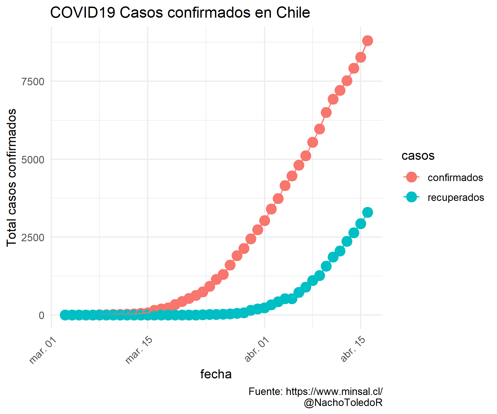
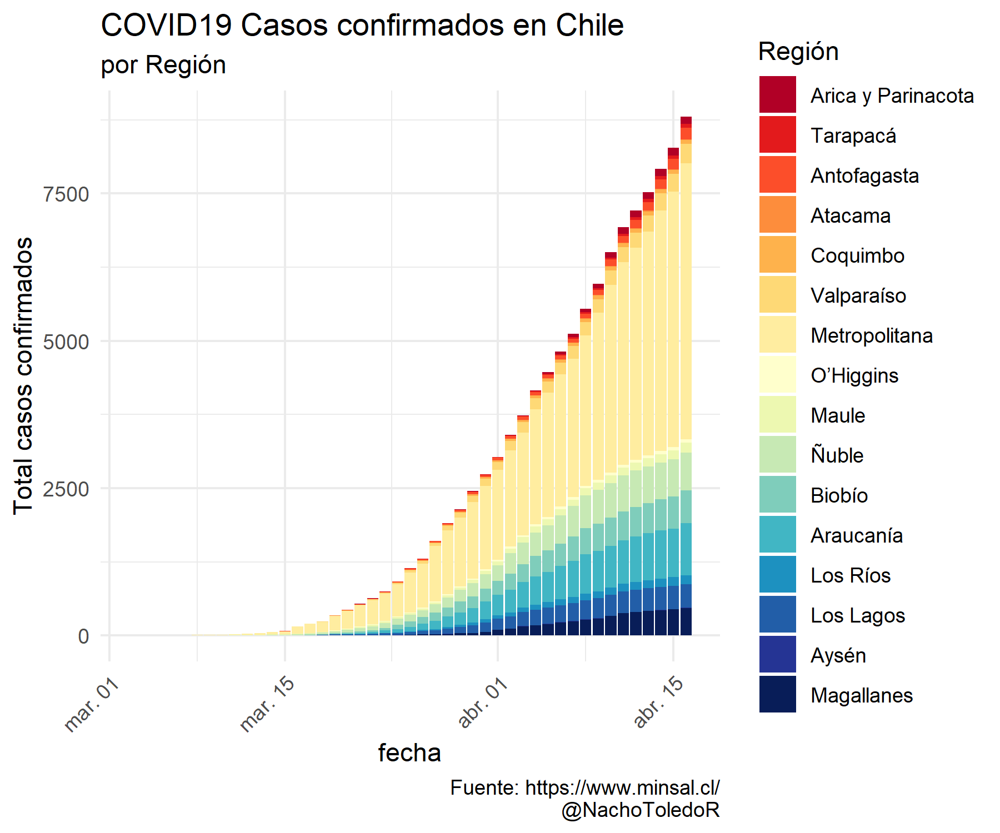

# COVID19 Casos confirmados en Chile

Este programa recolecta los datos sobre casos confirmados de COVID19 en Chile actualizados por el Ministerio de Salud. Los datos se descargan y almacenan en un archivo *.csv* por cada día. Los archivos se leen y se actualiza la visualización de los casos totales desagregada por región. La imagen se almacena y se comparte por Twitter de forma automática a las 12:00 horas de cada día.

La información contenida en la imagen es la misma publicada diariamente por el Ministerio de Salud y tiene como única finalidad la difusión de la información de la evolución del COVID19 en Chile. Los datos son públicos, por favor utilizar con responsabilidad.

Debo aclarar que no soy especialista en Epidemiología ni en campos relacionados, si usted tampoco es un especialista en el área por favor absténgase de correr regresiones, modelos y/o generar proyecciones, esto podría generar percepciones erradas sobre fenómeno y tener consecuencias no deseadas. 

Y lo más importante, reiterar la importancia de medidas preventivas como el lavado frecuente de manos y el distanciamiento social. Juntos podemos #AplanarLaCurva.
